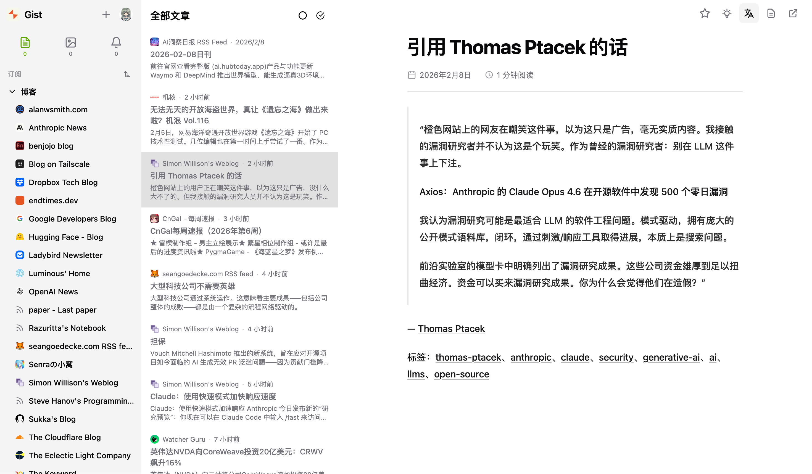

# Gist

[](https://www.gnu.org/licenses/old-licenses/gpl-2.0.en.html) [](https://deepwiki.com/9bingyin/Gist) [![zread](https://img.shields.io/badge/Ask_Zread-_.svg?style=flat&color=00b0aa&labelColor=000000&logo=data%3Aimage%2Fsvg%2Bxml%3Bbase64%2CPHN2ZyB3aWR0aD0iMTYiIGhlaWdodD0iMTYiIHZpZXdCb3g9IjAgMCAxNiAxNiIgZmlsbD0ibm9uZSIgeG1sbnM9Imh0dHA6Ly93d3cudzMub3JnLzIwMDAvc3ZnIj4KPHBhdGggZD0iTTQuOTYxNTYgMS42MDAxSDIuMjQxNTZDMS44ODgxIDEuNjAwMSAxLjYwMTU2IDEuODg2NjQgMS42MDE1NiAyLjI0MDFWNC45NjAxQzEuNjAxNTYgNS4zMTM1NiAxLjg4ODEgNS42MDAxIDIuMjQxNTYgNS42MDAxSDQuOTYxNTZDNS4zMTUwMiA1LjYwMDEgNS42MDE1NiA1LjMxMzU2IDUuNjAxNTYgNC45NjAxVjIuMjQwMUM1LjYwMTU2IDEuODg2NjQgNS4zMTUwMiAxLjYwMDEgNC45NjE1NiAxLjYwMDFaIiBmaWxsPSIjZmZmIi8%2BCjxwYXRoIGQ9Ik00Ljk2MTU2IDEwLjM5OTlIMi4yNDE1NkMxLjg4ODEgMTAuMzk5OSAxLjYwMTU2IDEwLjY4NjQgMS42MDE1NiAxMS4wMzk5VjEzLjc1OTlDMS42MDE1NiAxNC4xMTM0IDEuODg4MSAxNC4zOTk5IDIuMjQxNTYgMTQuMzk5OUg0Ljk2MTU2QzUuMzE1MDIgMTQuMzk5OSA1LjYwMTU2IDE0LjExMzQgNS42MDE1NiAxMy43NTk5VjExLjAzOTlDNS42MDE1NiAxMC42ODY0IDUuMzE1MDIgMTAuMzk5OSA0Ljk2MTU2IDEwLjM5OTlaIiBmaWxsPSIjZmZmIi8%2BCjxwYXRoIGQ9Ik0xMy43NTg0IDEuNjAwMUgxMS4wMzg0QzEwLjY4NSAxLjYwMDEgMTAuMzk4NCAxLjg4NjY0IDEwLjM5ODQgMi4yNDAxVjQuOTYwMUMxMC4zOTg0IDUuMzEzNTYgMTAuNjg1IDUuNjAwMSAxMS4wMzg0IDUuNjAwMUgxMy43NTg0QzE0LjExMTkgNS42MDAxIDE0LjM5ODQgNS4zMTM1NiAxNC4zOTg0IDQuOTYwMVYyLjI0MDFDMTQuMzk4NCAxLjg4NjY0IDE0LjExMTkgMS42MDAxIDEzLjc1ODQgMS42MDAxWiIgZmlsbD0iI2ZmZiIvPgo8cGF0aCBkPSJNNCAxMkwxMiA0TDQgMTJaIiBmaWxsPSIjZmZmIi8%2BCjxwYXRoIGQ9Ik00IDEyTDEyIDQiIHN0cm9rZT0iI2ZmZiIgc3Ryb2tlLXdpZHRoPSIxLjUiIHN0cm9rZS1saW5lY2FwPSJyb3VuZCIvPgo8L3N2Zz4K&logoColor=ffffff)](https://zread.ai/9bingyin/Gist)

[](https://github.com/9bingyin/Gist/releases/latest) [](https://github.com/9bingyin/Gist/actions/workflows/docker-build.yml)

轻量级自托管 RSS 阅读器，内置 AI 摘要、翻译、结构化分析与日报能力。



## 功能特性

- 全格式订阅，支持 RSS 2.0 / Atom / JSON Feed
- Readability 沉浸式阅读模式
- AI 摘要、翻译、结构化分析，支持 OpenAI / Anthropic / 兼容接口（BYOK）
- AI 自动摘要与自动分析，可在文章进入系统后后台异步处理
- 文章详情页展示 AI 后台任务状态
- AI 分析库页面，集中查看已入库的 AI 分析结果
- AI 日报页面，基于已入库分析结果按日聚合
- AI 日报与 AI 分析库支持通过共享 API Key 免登录供外部系统调用
- AI 分析结果会在数据库中持久化，分析标题会翻译为中文后再用于入库展示
- AI 分析完成后自动归档为 Markdown 文件，按日期 / 订阅文件夹 / 订阅源保存
- 文件夹分层管理与内容分类
- 浅色 / 深色 / 跟随系统主题
- PWA，可安装到桌面和移动设备
- 多语言（简体中文 / English）

## AI 相关新增说明

### AI 分析库

- 后端会将 AI 分析结果保存到数据库中的 `ai_analyses`
- AI 分析库标题优先读取中文翻译缓存 `ai_list_translations`
- 前端页面入口为 `/ai-analyses`

### AI 日报

- AI 日报基于当日已入库的 AI 分析结果实时聚合
- 前端页面入口为 `/ai-daily-report`
- 后端接口为 `GET /api/ai/reports/daily?date=YYYY-MM-DD`

### 外部系统免登录调用

- 已支持通过共享 API Key 调用：
  - `GET /api/ai/reports/daily`
  - `GET /api/ai/analyses`
- 请求头支持：
  - `Authorization: Bearer <token>`
  - `X-Gist-API-Key: <key>`
  - `X-API-Key: <key>`
- 共享访问密钥可在系统设置中配置

### AI Markdown 归档

- AI 分析完成后会额外生成一份 Markdown 文件
- 当前后端启动配置会将分析结果保存到 `/Users/usr/gist-data`
- 路径结构示例：

```text
/Users/usr/gist-data/20260407/CnNews/俄罗斯卫星通信社/阮春福当选国家主席.md
```

## 部署

### Docker Compose（推荐）

```bash
curl -O https://raw.githubusercontent.com/9bingyin/Gist/main/docker-compose.yml
docker compose up -d
```

或手动创建 `docker-compose.yml`：

```yaml
services:
  gist:
    image: ghcr.io/9bingyin/gist:latest
    container_name: gist
    ports:
      - "8080:8080"
    volumes:
      - ./data:/app/data
    environment:
      - GIST_LOG_LEVEL=info
    restart: always
```

访问 [http://localhost:8080](http://localhost:8080)，数据持久化在 `./data` 目录。

### Docker Run

```bash
docker run -d \
  --name gist \
  -p 8080:8080 \
  -v ./data:/app/data \
  ghcr.io/9bingyin/gist:latest
```

### 离线部署（无外网）

当部署服务器无法访问外网时，请在有网络的机器上构建镜像并 `docker save` 导出，然后在服务器上 `docker load` 导入运行。

详见 [offline-docker.md](/Users/usr/Gist-bg/docs/offline-docker.md)。

### 本地构建 Docker 镜像

项目已内置多阶段构建文件 [Dockerfile](/Users/usr/Gist-bg/docker/Dockerfile)。

```bash
cd /Users/usr/Gist-bg
docker build -f docker/Dockerfile -t gist:local .
```

运行示例：

```bash
docker run -d \
  --name gist \
  -p 8080:8080 \
  -v /Users/usr/gist-data:/app/data \
  -e GIST_LOG_LEVEL=info \
  -e GIST_EXPORT_DIR=/app/data \
  gist:local
```

## 环境变量

| 变量 | 默认值 | 说明 |
|------|--------|------|
| `GIST_ADDR` | `:8080` | 监听地址 |
| `GIST_DATA_DIR` | `./data` | 数据目录 |
| `GIST_DB_PATH` | `$GIST_DATA_DIR/gist.db` | SQLite 数据库路径 |
| `GIST_STATIC_DIR` | 自动探测 `frontend/dist` | 后端静态文件目录 |
| `GIST_EXPORT_DIR` | `$GIST_DATA_DIR/exports` | 普通文章 Markdown 导出目录 |
| `GIST_LOG_LEVEL` | `info` | 日志级别，支持 `debug` / `info` / `warn` / `error` |
| `GIST_SWAGGER` | `false` | 是否启用 Swagger |

## 本地开发

### 前置依赖

- Go 1.25+
- [Bun](https://bun.sh/)

### 方式一：前后端分离开发

适合日常开发。前端使用 Vite 开发服务器，`/api` 会自动代理到后端 `http://localhost:8080`。

终端 1：启动后端 API

```bash
cd /Users/usr/Gist-bg/backend
go mod download
go run ./cmd/server/main.go
```

终端 2：启动前端开发服务器

```bash
cd /Users/usr/Gist-bg/frontend
bun install
bun run dev
```

然后访问 Vite 输出的本地地址，通常是 [http://localhost:5173](http://localhost:5173)。

### 方式二：前端先构建，后端直接托管静态文件

适合接近生产环境的本地联调。

先构建前端：

```bash
cd /Users/usr/Gist-bg/frontend
bun install
bun run build
```

再启动后端：

```bash
cd /Users/usr/Gist-bg
GIST_STATIC_DIR=/Users/usr/Gist-bg/frontend/dist \
GIST_EXPORT_DIR=/Users/usr/gist-data \
go run ./backend/cmd/server/main.go
```

启动后直接访问 [http://localhost:8080](http://localhost:8080)。

### 前端单独构建

```bash
cd /Users/usr/Gist-bg/frontend
bun install
bun run build
```

### 后端单独构建

```bash
cd /Users/usr/Gist-bg/backend
go build -o gist-server ./cmd/server
```

## 测试

### 后端

```bash
cd /Users/usr/Gist-bg/backend
make test
make lint
```

### 前端

```bash
cd /Users/usr/Gist-bg/frontend
bun run test
bun run lint
```

## 许可证

[GPL-2.0](/Users/usr/Gist-bg/LICENSE)
